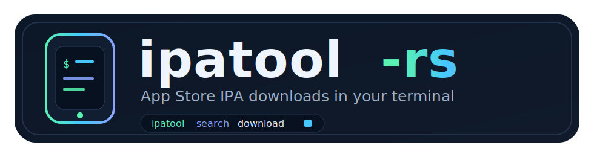

<p align="center">
  
</p>

<p align="center">
  A terminal UI and CLI for searching, purchasing, and downloading iOS App Store IPA files. Like ipatool, but rebuilt in Rust and adapted to Apple's current auth flow.
</p>

<p align="center">
  <a href="https://github.com/Kosthi/ipatool-rs/actions/workflows/ci.yml"></a>
  <a href="https://www.rust-lang.org/"></a>
  <a href="https://opensource.org/licenses/MIT"></a>
</p>

<p align="center">
  <a href="media/demo.svg"></a>
</p>

## Why This Exists

The original Go [ipatool](https://github.com/majd/ipatool) and many forks broke after Apple changed authentication endpoints.
`ipatool-rs` keeps the same practical goal: log in with an Apple ID, search the App Store, obtain free licenses, and download IPA files.

This rewrite adds a keyboard-driven terminal UI, structured Rust models, clearer errors, streaming downloads, and retry/reauth flows for unstable App Store responses.

## Features

- Interactive TUI mode: run `ipatool` to open tabs for Search, Library, Downloads, and Account.
- Search-to-download workflow: browse App Store results, inspect app details, purchase free licenses, and queue downloads from one screen.
- Download dashboard: track progress, failures, cancellation, and completed items in the Downloads tab.
- Account management: log in, handle 2FA, view the active account, and revoke stored credentials.
- Resilient sessions: refresh expired tokens during long-running interactive sessions when the password is still in memory.
- Robust downloads: stream IPA files with progress display and HTTP Range resume support in CLI mode.
- Patch-ready IPAs: inject purchase metadata and SINF authorization data into the downloaded archive.
- Text or JSON output for scripts and automation.

## Installation

### Homebrew (macOS / Linux)

```bash
brew install Kosthi/tap/ipatool
```

### Prebuilt Release Assets

Download the latest files from the [GitHub Releases](https://github.com/Kosthi/ipatool-rs/releases) page.

The release also includes `cargo-dist` installer scripts that install the `ipatool` binary into your Cargo bin directory.

```bash
# macOS / Linux
curl --proto '=https' --tlsv1.2 -LsSf https://github.com/Kosthi/ipatool-rs/releases/latest/download/ipatool-installer.sh | sh

# Windows PowerShell
powershell -ExecutionPolicy Bypass -c "irm https://github.com/Kosthi/ipatool-rs/releases/latest/download/ipatool-installer.ps1 | iex"
```

| Platform | Asset | Install |
|----------|-------|---------|
| Windows x64 | `ipatool-x86_64-pc-windows-msvc.zip` | Extract and place `ipatool.exe` on your `PATH`. |
| macOS Apple Silicon | `ipatool-aarch64-apple-darwin.tar.xz` | Extract and place `ipatool` on your `PATH`. |
| macOS Intel | `ipatool-x86_64-apple-darwin.tar.xz` | Extract and place `ipatool` on your `PATH`. |
| Linux x64 | `ipatool-x86_64-unknown-linux-gnu.tar.xz` | Extract and place `ipatool` on your `PATH`. |
| Linux ARM64 | `ipatool-aarch64-unknown-linux-gnu.tar.xz` | Extract and place `ipatool` on your `PATH`. |

Each release also includes per-asset `.sha256` files and a unified `sha256.sum`.

### Build From Source

```bash
git clone https://github.com/Kosthi/ipatool-rs.git
cd ipatool-rs
cargo build --release

# Binary at target/release/ipatool
```

## Usage

### Terminal UI

Launch the TUI by running `ipatool` without a subcommand.

```bash
ipatool
```

The UI is built with [ratatui](https://ratatui.rs/) and [crossterm](https://github.com/crossterm-rs/crossterm). It provides a fast keyboard workflow for login, search, purchase, download progress, and cancellation.

### CLI

Log in with your Apple ID. Two-factor authentication is supported.

```bash
# Interactive login (prompts for the password and 2FA code if Apple requires one)
ipatool auth login --email your@apple.id

# Non-interactive mode still supports --password and --auth-code for controlled automation,
# but those values can be visible in shell history and process lists.

# Show current account
ipatool auth info

# Log out and clear credentials
ipatool auth revoke
```

Search for apps on the App Store.

```bash
ipatool search "WeChat" --limit 10
ipatool search "Telegram" --limit 5 --country US
```

Obtain a free license for an app.

```bash
ipatool purchase -b com.tencent.xin
```

Download an IPA file. Use `--purchase` to automatically obtain the license before downloading.
By default, the IPA is saved in the current working directory as `{bundle_id}_{app_id}_{version}.ipa`.
Use `-o` to choose a different output path.

```bash
# Download with auto-purchase
ipatool download -b com.tencent.xin --purchase

# Use fewer or more ranged connections if a CDN path is slow or flaky
ipatool download -b com.tencent.xin --purchase --connections 4

# Specify output path
ipatool download -b com.tencent.xin --purchase -o ~/Downloads/wechat.ipa

# Download by app ID
ipatool download -i 414478124 --purchase

# Download a specific version
ipatool download -b com.tencent.xin --version-id 12345
```

List available versions and retrieve version metadata.

```bash
# List all versions
ipatool version list -b com.tencent.xin

# Get metadata for a specific version
ipatool version meta -b com.tencent.xin --version-id 12345
```

### Global Flags

```text
--format <text|json>    Output format (default: text)
--verbose               Enable debug logging
--non-interactive       Disable interactive prompts
```

## Keyboard Controls

**Global**

| Key | Action |
|-----|--------|
| `q` / `Ctrl+C` | Quit |
| `Tab` / `Shift+Tab` | Switch tabs |
| `1`-`4` | Jump to a tab |
| `j/k` or `Up/Down` | Navigate the current list |
| `Esc` | Cancel input or close a popup |

**Search tab**

| Key | Action |
|-----|--------|
| `/` / `s` | Focus the search input |
| `Enter` | Run search |
| `d` | Download selected app |
| `p` | Purchase selected app |

**Downloads tab**

| Key | Action |
|-----|--------|
| `x` | Cancel selected download |
| `c` | Clear finished downloads |

**Account tab**

| Key | Action |
|-----|--------|
| `l` | Log in |
| `r` | Revoke stored credentials |

## Project Structure

```text
ipatool-rs/
|-- Cargo.toml                  # Workspace root
|-- media/                      # README logo and demo assets
`-- crates/
    |-- ipatool-core/           # Core library
    |   `-- src/
    |       |-- api/            # Apple API endpoints
    |       |-- client/         # HTTP client, plist parser, cookie jar
    |       |-- model/          # Account, App, Platform, StoreFront types
    |       |-- ipa/            # IPA patching
    |       |-- error.rs        # Error hierarchy
    |       |-- credential.rs   # Keychain storage
    |       `-- guid.rs         # Device GUID generation
    `-- ipatool-cli/            # CLI binary
        `-- src/
            |-- main.rs         # Entry point and clap parsing
            |-- output.rs       # Text/JSON formatters
            |-- tui/            # Interactive terminal UI
            `-- commands/       # Subcommand handlers
```

## How It Works

1. **Auth** - Posts credentials to Apple's native auth endpoint using the legacy MZFinance protocol. Handles 2FA, redirects, retry logic, keychain storage for account tokens, and cookies. The raw Apple ID password is not persisted.

2. **Search/Lookup** - Queries the public iTunes Search API for app metadata and storefront-specific results.

3. **Purchase** - Sends a buy request to `buy.itunes.apple.com` with STDQ pricing and falls back to GAME for Apple Arcade-style responses.

4. **Download** - Fetches the download URL and DRM data from Apple's `volumeStoreDownloadProduct` endpoint, then streams the IPA.

5. **Patch** - Rebuilds the ZIP, injecting `iTunesMetadata.plist` and SINF files so the IPA can be installed on an authorized device.

6. **TUI** - Wraps the same core APIs in an async ratatui/crossterm interface with background tasks for search, login, purchase, and downloads.

## License

[MIT](LICENSE)
