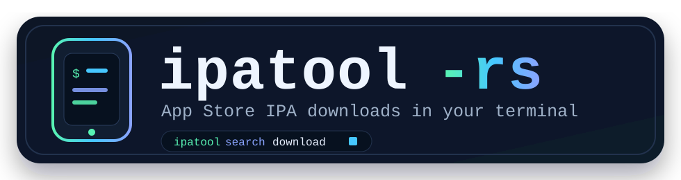

<p align="center">
  
</p>

<p align="center">
  一个用于搜索、购买和下载 iOS App Store IPA 文件的终端 UI 和 CLI 工具。基于 Rust 重写，兼容 Apple 最新的认证流程。
</p>

<p align="center">
  <a href="https://github.com/Kosthi/ipatool-rs/actions/workflows/ci.yml"></a>
  <a href="https://www.rust-lang.org/"></a>
  <a href="https://opensource.org/licenses/MIT"></a>
  <a href="https://star-history.com/#Kosthi/ipatool-rs&Date"></a>
</p>

<p align="center">
  <a href="media/demo.svg"></a>
</p>

[English](README.md) | 中文

## 为什么会有这个项目

原版 Go 语言实现的 [ipatool](https://github.com/majd/ipatool) 及其众多 fork，在 Apple 更改认证接口后相继失效。`ipatool-rs` 保持了相同的实用目标：使用 Apple ID 登录、搜索 App Store、获取免费授权并下载 IPA 文件。

本次重写新增了键盘驱动的终端 UI、结构化的 Rust 数据模型、更清晰的错误信息、流式下载，以及针对不稳定 App Store 响应的重试/重新认证机制。

## 与原版对比

| 功能 | [ipatool](https://github.com/majd/ipatool)（Go） | ipatool-rs（本项目） |
|------|--------------------------------------------------|----------------------|
| Apple ID 认证 | ❌ 2024 年认证变更后已失效 | ✅ 兼容最新接口 |
| 双因素认证（2FA） | ❌ 已失效 | ✅ 支持 |
| 交互式 TUI | ❌ 仅 CLI | ✅ 完整键盘驱动界面 |
| 下载进度显示 | ❌ 无 | ✅ 进度条 + 流式传输 |
| HTTP 断点续传 | ❌ 不支持 | ✅ 支持（CLI 模式） |
| 后台下载队列 | ❌ 不支持 | ✅ TUI 下载标签页 |
| Session 自动刷新 | ❌ 不支持 | ✅ Token 过期后自动重新认证 |
| 凭证存储 | 文件存储 | ✅ 系统钥匙串（macOS/Linux/Windows） |
| 输出格式 | 文本 | 文本 + JSON |
| 单二进制文件 | ✅ | ✅ |
| Windows 支持 | ✅ | ✅ |

## 功能特性

- **交互式 TUI 模式**：直接运行 `ipatool` 即可打开搜索、资料库、下载和账号四个标签页。
- **搜索到下载一体化**：在一个界面内浏览 App Store 搜索结果、查看应用详情、购买免费授权并加入下载队列。
- **下载仪表板**：在下载标签页中实时追踪进度、失败、取消和已完成的项目。
- **账号管理**：登录、处理 2FA、查看当前账号、撤销存储的凭证。
- **会话自动恢复**：在购买和下载流程中，当已存储凭证可用时，自动刷新过期的 token。
- **健壮的下载**：流式传输 IPA 文件并显示进度，CLI 模式支持 HTTP Range 断点续传。
- **IPA 注入修补**：将购买元数据和 SINF 授权数据注入下载的压缩包中。
- **文本或 JSON 输出**：方便脚本和自动化使用。

## 安装

### Homebrew（macOS / Linux）

```bash
brew install Kosthi/tap/ipatool
```

### Cargo

```bash
cargo install ipatool-rs
```

### 预编译发布版本

从 [GitHub Releases](https://github.com/Kosthi/ipatool-rs/releases) 页面下载最新文件。

```bash
# macOS / Linux
curl --proto '=https' --tlsv1.2 -LsSf https://github.com/Kosthi/ipatool-rs/releases/latest/download/ipatool-installer.sh | sh

# Windows PowerShell
powershell -ExecutionPolicy Bypass -c "irm https://github.com/Kosthi/ipatool-rs/releases/latest/download/ipatool-installer.ps1 | iex"
```

| 平台 | 文件 | 安装方式 |
|------|------|----------|
| Windows x64 | `ipatool-x86_64-pc-windows-msvc.zip` | 解压后将 `ipatool.exe` 放入 PATH。 |
| macOS Apple Silicon | `ipatool-aarch64-apple-darwin.tar.xz` | 解压后将 `ipatool` 放入 PATH。 |
| macOS Intel | `ipatool-x86_64-apple-darwin.tar.xz` | 解压后将 `ipatool` 放入 PATH。 |
| Linux x64 | `ipatool-x86_64-unknown-linux-gnu.tar.xz` | 解压后将 `ipatool` 放入 PATH。 |
| Linux ARM64 | `ipatool-aarch64-unknown-linux-gnu.tar.xz` | 解压后将 `ipatool` 放入 PATH。 |

每个发布版本还包含各资产的 `.sha256` 校验文件和统一的 `sha256.sum`。

### 从源码编译

```bash
git clone https://github.com/Kosthi/ipatool-rs.git
cd ipatool-rs
cargo build --release

# 二进制文件位于 target/release/ipatool
```
